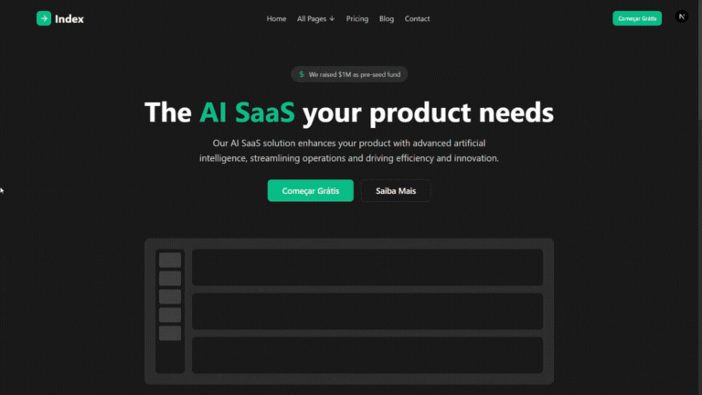
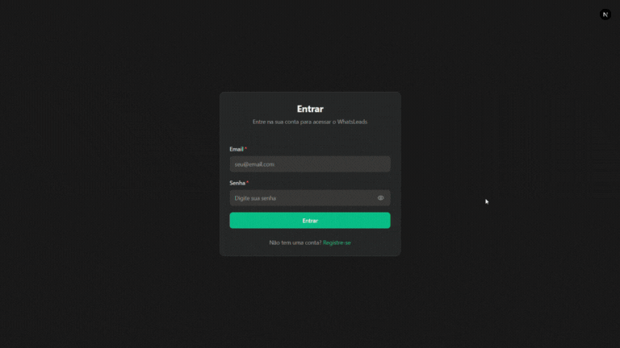
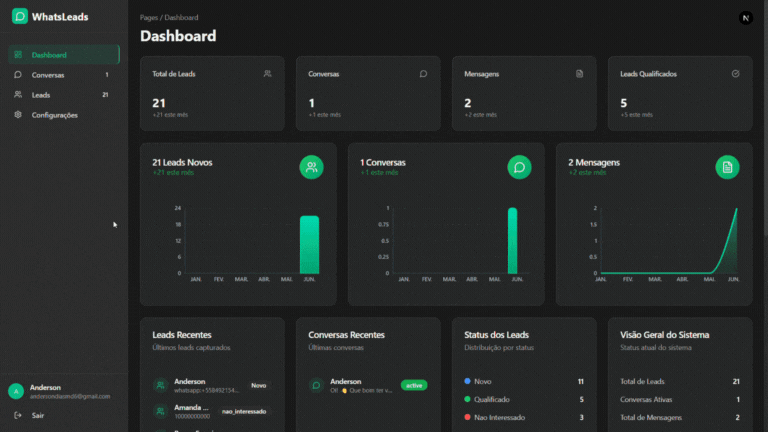
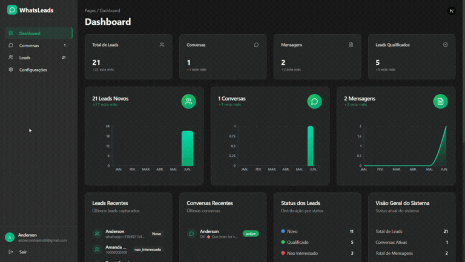
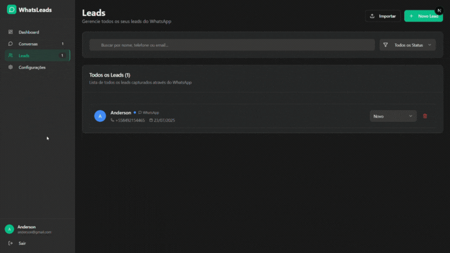
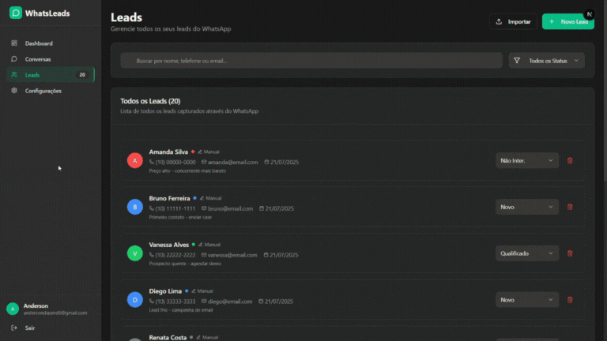
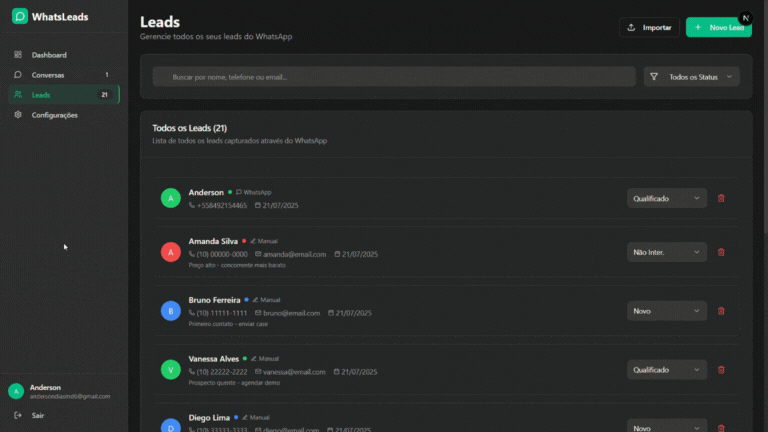
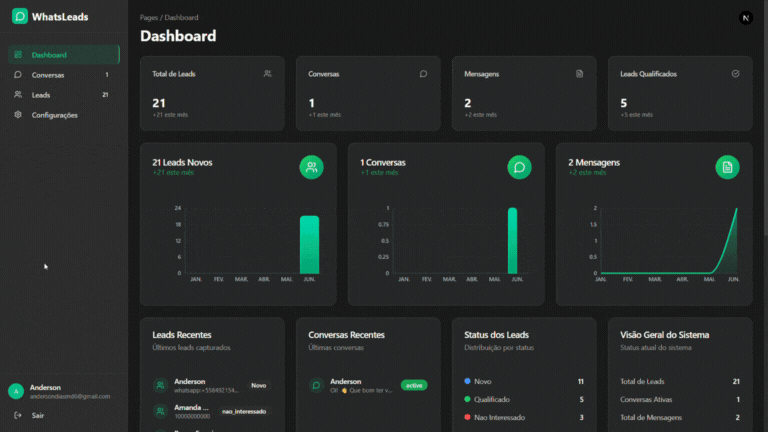
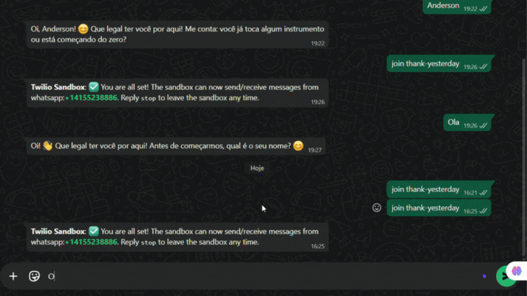
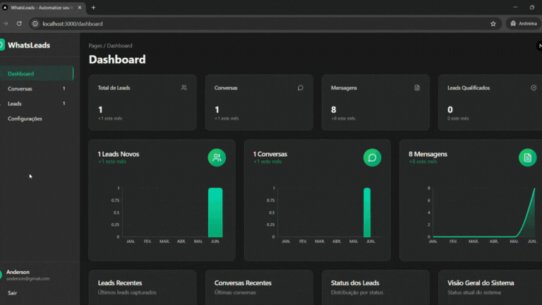

# 🤖 WhatsLeads - Sistema de Automação de Vendas via WhatsApp

<div align="center">


**Transforme conversas do WhatsApp em leads qualificados automaticamente**

[](https://nextjs.org/)
[](https://www.typescriptlang.org/)
[](https://www.prisma.io/)
[](https://tailwindcss.com/)

</div>

---

## 📋 Índice

- [🎯 Sobre o Projeto](#-sobre-o-projeto)
- [✨ Funcionalidades](#-funcionalidades)
- [🚀 Demonstração](#-demonstração)
- [🛠️ Tecnologias](#️-tecnologias)
- [📦 Instalação](#-instalação)
- [⚙️ Configuração](#️-configuração)
- [🎨 Interface](#-interface)
- [📊 Estrutura do Projeto](#-estrutura-do-projeto)
- [🤝 Contribuição](#-contribuição)
- [📄 Licença](#-licença)

---

## 🎯 Sobre o Projeto

O **WhatsLeads** é um SaaS completo para automação de vendas via WhatsApp. O sistema captura automaticamente conversas do WhatsApp, qualifica leads usando inteligência artificial e fornece um dashboard completo para gerenciamento de vendas.

### 🎯 Principais Benefícios

- **Automação Completa**: Captura automática de conversas do WhatsApp
- **IA Integrada**: Qualificação inteligente de leads usando OpenAI
- **Dashboard Intuitivo**: Interface moderna e responsiva
- **Integração Twilio**: Conexão direta com WhatsApp Business API
- **Gestão de Leads**: Sistema completo de CRM integrado

---

## ✨ Funcionalidades

### 🔐 **Sistema de Autenticação**
- Registro e login de usuários
- Autenticação segura com NextAuth.js
- Proteção de rotas e sessões

### 📱 **Integração WhatsApp**
- Conexão com Twilio WhatsApp Business API
- Captura automática de mensagens
- Webhook para recebimento em tempo real

### 🤖 **Inteligência Artificial**
- Qualificação automática de leads
- Análise de intenção de compra
- Respostas automáticas personalizadas
- Integração com OpenAI GPT

### 📊 **Dashboard Analytics**
- Métricas em tempo real
- Gráficos de performance
- Relatórios de conversão
- KPIs de vendas

### 👥 **Gestão de Leads**
- Cadastro manual e automático
- Categorização por status
- Histórico completo de interações
- Importação em lote via CSV

### 💬 **Sistema de Conversas**
- Visualização de conversas completas
- Histórico de mensagens
- Status de leitura e entrega
- Interface similar ao WhatsApp

---

## 🚀 Demonstração

### 1. **Criação de Conta**


O processo de registro é simples e intuitivo. Os usuários podem criar uma conta fornecendo informações básicas como nome, email, senha e nome da empresa.

### 2. **Login no Sistema**


Acesso seguro ao sistema com autenticação robusta e redirecionamento automático para o dashboard.

### 3. **Dashboard Principal**


O dashboard oferece uma visão completa do negócio com:
- **KPIs em tempo real**: Total de leads, conversas ativas, taxa de conversão
- **Gráficos interativos**: Evolução mensal de leads e conversas
- **Métricas de performance**: Análise detalhada de vendas
- **Notificações**: Alertas de novas conversas e leads

### 4. **Lista de Leads**


Gerenciamento completo de leads com:
- **Filtros avançados**: Por status
- **Busca inteligente**: Por nome
- **Ações em lote**: Atualização de status múltiplo
- **Importação CSV**: Carregamento de leads em massa

### 5. **Criação Manual de Lead**


Cadastro manual de leads com validação de dados e integração automática com o sistema de conversas.

### 6. **Atualização de Lead**


Edição de informações do lead com histórico de alterações e rastreamento de mudanças.

### 7. **Deleção de Lead**


Remoção segura de leads com confirmação e backup de dados.

### 8. **Visualização de Conversa**


Interface de conversa similar ao WhatsApp com:
- **Histórico completo**: Todas as mensagens trocadas
- **Status de entrega**: Confirmação de leitura
- **Informações do lead**: Dados do contato integrados
- **Ações rápidas**: Qualificação e notas

### 9. **Conversa no WhatsApp**


Demonstração da integração real com WhatsApp Business, mostrando como as mensagens são capturadas e sincronizadas automaticamente.

### 10. **Lead e Sua Conversa**


Visão integrada mostrando como um lead está conectado com sua conversa correspondente, permitindo gestão completa do relacionamento.

### 11. **Configurações do Sistema**


Painel de configurações com:
- **Integração Twilio**: Configuração de credenciais
- **OpenAI API**: Chave para IA
- **Dados da empresa**: Personalização da marca
- **Webhooks**: Configuração de notificações

---

## 🛠️ Tecnologias

### **Frontend**
- **Next.js 15.4.1** - Framework React com App Router
- **TypeScript 5.0** - Tipagem estática
- **Tailwind CSS 3.4.17** - Framework CSS utilitário
- **Radix UI** - Componentes acessíveis
- **Lucide React** - Ícones modernos
- **Recharts** - Gráficos interativos

### **Backend**
- **Next.js API Routes** - API RESTful
- **Prisma 6.12.0** - ORM moderno
- **SQLite** - Banco de dados
- **NextAuth.js** - Autenticação
- **bcryptjs** - Hash de senhas

### **Integrações**
- **Twilio** - WhatsApp Business API
- **OpenAI** - Inteligência Artificial

### **Ferramentas de Desenvolvimento**
- **ESLint** - Linting de código
- **Jest** - Testes unitários
- **Testing Library** - Testes de componentes
- **Turbopack** - Bundler rápido

---

## 📦 Instalação

### Pré-requisitos
- Node.js 18+ 
- npm ou yarn
- Conta Twilio (para WhatsApp Business)
- Chave API OpenAI

### 1. Clone o repositório
```bash
git clone https://github.com/seu-usuario/saas-whats-leads-users.git
cd saas-whats-leads-users
```

### 2. Instale as dependências
```bash
npm install
# ou
yarn install
```

### 3. Configure as variáveis de ambiente
```bash
cp .env.example .env.local
```

Edite o arquivo `.env.local` com suas configurações:
```env
# Database
DATABASE_URL="file:./dev.db"

# NextAuth
NEXTAUTH_SECRET="seu-secret-aqui"
NEXTAUTH_URL="http://localhost:3000"


### 4. Configure o banco de dados
```bash
npx prisma generate
npx prisma db push
```

### 5. Execute o projeto
```bash
npm run dev
# ou
yarn dev
```

---

## ⚙️ Configuração

### Configuração do Twilio

1. **Crie uma conta no Twilio**
2. **Ative o WhatsApp Business API**
3. **Configure o webhook**:
   - URL: `https://seu-dominio.com/api/webhooks/twilio`
   - Método: POST

### Configuração da OpenAI

1. **Obtenha uma chave API** em [platform.openai.com](https://platform.openai.com)
2. **Configure no painel** de configurações do sistema
3. **Personalize o prompt** de qualificação de leads

### Configuração de Produção

```bash
# Build para produção
npm run build

# Iniciar servidor de produção
npm start
```

---

## 🎨 Interface

### Design System
- **Tema escuro/claro** automático
- **Componentes reutilizáveis** com Radix UI
- **Responsividade completa** para mobile e desktop
- **Acessibilidade** seguindo padrões WCAG

### Componentes Principais
- **Dashboard Cards** - Métricas e KPIs
- **Data Tables** - Listas com paginação
- **Forms** - Validação com Zod
- **Modals** - Diálogos e confirmações
- **Charts** - Gráficos interativos

---

## 📊 Estrutura do Projeto

```
src/
├── app/                    # App Router (Next.js 13+)
│   ├── api/               # API Routes
│   ├── dashboard/         # Páginas do dashboard
│   ├── login/            # Página de login
│   └── register/         # Página de registro
├── components/           # Componentes React
│   ├── ui/              # Componentes base
│   ├── auth/            # Componentes de autenticação
│   ├── dashboard/       # Componentes do dashboard
│   └── leads/           # Componentes de leads
├── hooks/               # Custom hooks
├── lib/                 # Utilitários e configurações
├── schemas/             # Schemas de validação (Zod)
├── services/            # Lógica de negócio
└── types/               # Tipos TypeScript

prisma/
├── schema.prisma        # Schema do banco de dados
└── migrations/          # Migrações do banco

public/
├── videos/             # GIFs demonstrativos
└── ...                 # Arquivos estáticos
```

---

## 🤝 Contribuição

1. **Fork o projeto**
2. **Crie uma branch** para sua feature (`git checkout -b feature/AmazingFeature`)
3. **Commit suas mudanças** (`git commit -m 'Add some AmazingFeature'`)
4. **Push para a branch** (`git push origin feature/AmazingFeature`)
5. **Abra um Pull Request**

### Padrões de Código
- **TypeScript** para tipagem
- **ESLint** para linting
- **Prettier** para formatação
- **Conventional Commits** para mensagens

---

## 📄 Licença

Este projeto está sob a licença MIT. Veja o arquivo [LICENSE](LICENSE) para mais detalhes.


---

<div align="center">

**Desenvolvido com ❤️ para revolucionar a automação de vendas**

[](https://github.com/seu-usuario/cursor-saas-whats-leads)
[](https://github.com/seu-usuario/cursor-saas-whats-leads)

</div>
